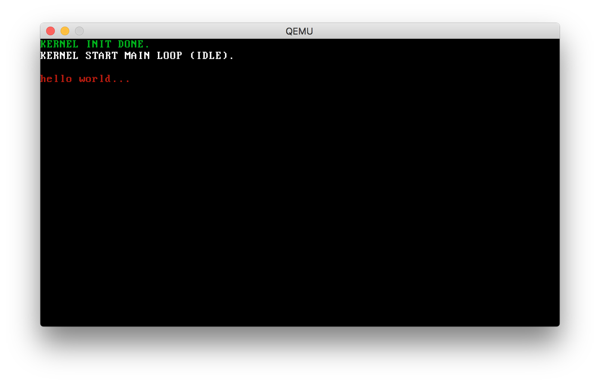

## A simple toy kernel

### Overview

A simple tony kernel, just a study on how to write a OS kernel.

### Book

[Bran's Kernel Development](http://www.osdever.net/bkerndev/Docs/title.htm)

### Platform

1. CentOS-7-x86_64-Minimal-1511 but is i386 32bit platform
2. NASM
3. GCC
4. LD

### Make

See Makefile.

### Run

#### Mac OS

Run on QEMU:

    qemu-system-i386 -kernel kernel.bin

#### Linux/Unix/Windows

Bochs
